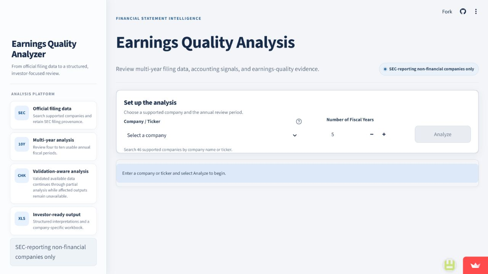

# Earnings Quality Analyzer

A Streamlit application that reviews multi-year SEC filing data and organizes the results into an investor-focused earnings-quality assessment. The tool is designed for SEC-reporting, non-financial companies and keeps filing provenance attached to the analysis.

**Live application:** [Open the Earnings Quality Analyzer](https://earnings-quality-analyzer-mnamprusasdmbe5uycxejk.streamlit.app/)



## Financial problem

Reported earnings do not always translate into recurring cash generation. Analysts therefore need to compare net income with operating cash flow, review accruals and working-capital changes, assess capital intensity, and identify items that may distort reported results. This project brings those checks into one repeatable workflow while preserving the source and validation status of the underlying filing data.

## Main features

- Search supported public companies by name or ticker.
- Retrieve four to ten annual fiscal periods from official SEC filing data.
- Validate company identity, fiscal years, units, duplicates, missing values, and source provenance.
- Continue with partial analysis when valid data is available while marking affected outputs as unavailable.
- Present financial statements, calculation tables, red flags, interpretations, and an overall conclusion in a Streamlit interface.
- Export a company-specific Excel report.

## Analysis performed

The application evaluates the signals supported by the available filing data, including:

- Net income versus operating cash flow and accrual quality.
- Revenue growth compared with receivables and inventory growth.
- Free cash flow, capital expenditure, and depreciation and amortization trends.
- Operating working-capital changes.
- Stock-based compensation, share dilution, and buyback context.
- Deferred-tax balances and tax-related warning signals.
- Reported versus normalized earnings and potential one-off items.
- Severity-ranked red flags and a validation-aware earnings-quality conclusion.

## How it works

1. The user selects a supported company and analysis period.
2. The data pipeline identifies the company and retrieves official SEC facts.
3. Validation checks review fiscal periods, units, missing values, duplicate facts, and provenance.
4. Calculation modules produce the financial ratios, trends, and cash-flow comparisons.
5. Rule and interpretation modules organize the evidence into review items and conclusions.
6. Streamlit presents the results and makes an Excel export available.

## Technology

- Python
- Pandas
- Streamlit
- Altair and Matplotlib
- OpenPyXL
- SEC company facts and filing data

## Run locally

Python 3.11 or later is recommended.

```bash
git clone https://github.com/petrusatallah/earnings-quality-analyzer.git
cd earnings-quality-analyzer
python -m venv .venv
```

Activate the environment, then install the pinned dependencies and start the app:

```bash
python -m pip install -r requirements.txt
streamlit run app.py
```

The SEC requires a descriptive user agent for automated requests. Set `SEC_USER_AGENT` locally to a value that identifies the application and includes a contact email. Do not commit it to the repository.

## Project structure

```text
earnings-quality-analyzer/
├── Analysis/       # Red-flag rules, interpretations, charts, and reporting views
├── Calculations/   # Financial calculations and trend analysis
├── Data/           # SEC retrieval, validation, mappings, and provenance
├── test/           # Automated calculation, validation, and UI tests
├── screenshots/    # Repository preview image
├── app.py          # Streamlit interface
├── main.py         # Analysis pipeline and Excel export workflow
└── requirements.txt
```

## Limitations and disclaimer

Coverage depends on the availability and comparability of SEC filing facts. Differences in company reporting, taxonomy tags, fiscal calendars, and one-off disclosures can affect the analysis. Review the source and validation tables before interpreting an output.

This project is an analytical and educational tool. It does not provide investment advice, a recommendation, or a substitute for independent financial analysis.
